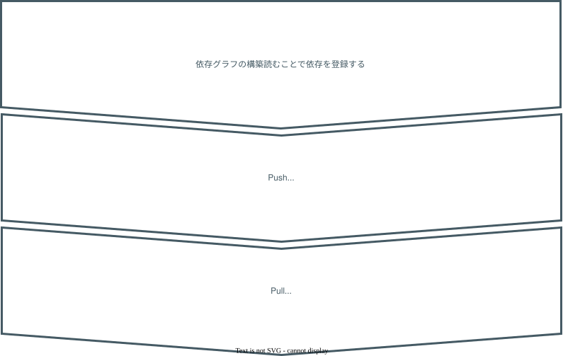

<script type="module">
import mermaid from 'https://cdn.jsdelivr.net/npm/mermaid@10/dist/mermaid.esm.min.mjs';
mermaid.initialize({
  startOnLoad: true,
});
</script>

<!-- _class: lead invert -->
<!-- _paginate: false -->
# Signals Deep Dive

フロントエンド・PHPカンファレンス北海道 2026

nishitaku

---
<style scoped>
section h1 {
  margin-bottom: 70px;
}
</style>

# 初めまして

<div class="profile">


<div>

#### 西濃 拓郎（にしの たくろう）

#### [@nishitaku](https://x.com/nishitaku_dev)

#### フリーランス（10年目）


</div>

</div>


<!-- 
初めまして、西濃拓郎といいます。
nishitakuのハンドルネームでフリーランスのエンジニアとして活動しています。
これを機にどれぐらいフリーランスをやってたのか調べたら、開業届を出したのが2016年の11月だったので、今年で10年目になりました。記念すべき年に、こういう場で登壇させていただいて、ありがたい限りです。
Angularが好きで、よく使っています。使ってる人少ないので寂しい。昔に比べてかなり使いやすくなったので、ぜひ使ってみてほしい。
-->

---
<!-- _class: lead -->

# Signals 知ってる人〜 :hand:

#### （Vue.jsのref、SvelteのRuneなど含む）

<!--
本セッションはSignals Deep Diveということで。
早速ですが、ちょっと聞いてみたいことがあります。
signals知ってる人〜。使ってる人〜。
Vueのrefやスベルトのルーンも含めちゃっていいです！
やっぱりReactの人が多いのか、使ってる人は少ないですね。
-->

---
<style scoped>
section h2 {
  margin-bottom: 60px;
}
</style>

# これから話すこと

## **Signals がどういう仕組みで<br>どうやって必要な箇所だけを更新しているのか**

# 持ち帰ってもらいたいこと

## **Signals の内部実装を理解して<br>リアクティブシステムの勘所を掴む**

<!-- 
このセッションはDeep Diveです。
Deep Diveの価値は、ブラックボックスを減らして、なぜそう動くのかを理解することで、不具合調査やパフォーマンス改善の精度をあげることにあると思っています。
このセッションではsignalsがどういう仕組みで動いているのか、どうやって効率的に必要な箇所だけを更新しているのかを解説していきます。
signalsは各種フロントエンドFWも採用されていて、モダンフロントエンドのリアクティブシステムの基盤になっているといえます。
つまり、signalsの内部実装を理解することで、リアクティブシステムの勘所を掴んでもらうことができます。
 -->

---
<style scoped>
section h5 {
  margin-left: 60px;
}
</style>

## 目次

#### 1. Signals 概要
#### 2. Signals の特徴
##### 特徴① 依存関係の自動追跡
##### 特徴② Push-Pull ハイブリッド方式
##### 特徴③ メモ化
#### 3. Signal Polyfill の実装を読む

<!-- 
本日の目次です。
まず、signalsを知らない人もいると思うので、ざっくりと概要を説明します。
その後、signalsの大きな特徴として、依存関係の自動追跡、Push-Pullハイブリッド方式、メモ化の3つを順番に解説していきます。実際はもっとあるんですが、今回はこの3つを紹介します。もっと詳しく聞きたい人は、このあとask the speakerや懇親会でお話ししましょう。
最後に、signal polyfillの実装を読んで、signalがどうやって依存関係の追跡を実現しているのかを詳しく見ていきたいと思います。
だんだんDeep Diveしていく感じです。
-->
---

<!-- _class: lead invert -->
<!-- _paginate: false -->

# Signals 概要

---
<style scoped>
  section ul {
    margin-top: 0px;
  }
</style>

## Signals 概要

```ts
const counter = new Signal.State(0);
const isEven = new Signal.Computed(() => (counter.get() & 1) == 0);
effect(() => { element.innerText = isEven.get() });
```

- 状態と**依存関係**を効率的に扱うリアクティブモデル
- 各種フレームワーク(Angular/Preact/Svelte/Vue ...etc)で採用
- 基本3要素
  - **State**: 手動で設定される値
  - **Computed**: Stateに依存して計算される値
  - **Effect**: StateやComputedに依存して実行されるコールバック
- TC39 proposal-signals (Stage 1)

<!-- 
signalsは状態と依存関係を効率的に扱う、プリミティブなリアクティブモデルです。この依存関係というのがこれから何度もでてくる重要なキーワードになります。
フロントエンドの各種フレームワークで採用されています。自分もAngularで使っています。
Signalsの基本概念として、State、Computed、Effectの3要素があります。このサンプルコードを見てください。
また、TC39のプロポーザルがあがっている。まだstage1だが、将来的にJavaScriptの標準APIとして実装されて、各フレームワークの独自実装を置き換えようとしています。
本セッションでこれから話す内容は、このTC39のプロポーザルの内容がベースになっています。
-->

---
<!-- _class: lead invert -->
<!-- _paginate: false -->

# Signals の特徴①

# 依存関係の自動追跡

<!-- 
それでは、signalの特徴について見ていきたいと思います。
まず、1つ目の特徴として依存関係の自動追跡について解説していきます。
 -->

---

## Vanilla JSの場合

```js
let counter = 0;
const setCounter = (value) => {
  counter = value;
  render();
};

const isEven = () => (counter & 1) == 0;
const parity = () => isEven() ? "even" : "odd";
const render = () => element.innerText = parity();

setInterval(() => setCounter(counter + 1), 1000);
```

#### 開発者が依存関係を知っておく必要がある<br>→ **変更時の対応漏れや過剰更新が問題になり、スケールしない**

<!-- 
まずはこちらのコードをご覧ください。VanillaJSでカウンターと偶奇判定を実装するサンプルコードになります。counterという変数があり、counterが偶数かどうかを判定するisEven。isEvenのbool値を元に、evenかoddのラベルを出力するparity。parityをDOMにレンダリングするrender関数。counterを更新してrender関数を呼び出すsetCounter関数。で実装されています。
counterの値に依存したparityが描画されている、つまり、counterを変更した場合は、必ずsetCounterを読んで再描画する必要がある、というコードになります。
このコードの大きな問題は、依存関係を開発者が知っておく必要がある、ということです。状態や計算、UIが複雑になっていくと、知っておくべき依存関係が増えるため、変更時の対応漏れや過剰な更新が発生し、アプリケーションがスケールしません。

(補足)例えば、別の開発者がisEvenの値を表示したい、とします。その人はisEvenがcounterに依存していること知らないため、setCounterで、そのisEvenを表示する関数を呼び出すのを忘れてしまい、結果、counterが更新されてもisEvenの表示が更新されない、という問題が発生します。
 -->

---

## Signals の場合

```js
const counter = new Signal.State(0);
const isEven = new Signal.Computed(() => (counter.get() & 1) == 0);
const parity = new Signal.Computed(() => isEven.get() ? "even" : "odd");

effect(() => {
  element.innerText = parity.get();
});

setInterval(() => counter.set(counter.get() + 1), 1000);
```

#### 依存関係を自動で追跡してくれる<br>→ **依存関係が増えてもスケールしやすい**

<!-- 
先ほどの例をsignalsで書き換えるとこうなります。
まずcounterはStateで定義します。
isEvenはcounterに依存するComputed、parityはisEvenに依存するComputedになります。こうすることで、counterが変更されたときに、isEvenが自動で計算され、isEvenが変更されたときにparityが自動で計算されます。
さらに、effectはparityに依存します。こうすることで、parityが変更されたときに、effect内のコールバックが呼ばれ、自動でレンダリングされます。
このように、signalsを使えば、依存関係を自動で追跡してくれるので、依存関係が増えてもスケールしやすいのがsignalの大きな特徴の１つと言えます。
-->

---

## 宣言的UIの場合

```js
// JavaScript
let name = "太郎";
let age = 20;
const validatedName = () => f(name); // nameに依存
const parity = () => (age % 2 === 0 ? '偶数' : '奇数'); // ageに依存

// HTML
<p>名前は{{ validatedName() }}です</p>
<p>年齢は{{ parity() }}です。</p>
```

#### 依存関係がわからないと、`age`が変更されたときに<br>`parity`だけでなく`validatedName`も再計算する必要がある

<!-- 
次に、フロントエンド開発でおなじみの宣言的UIの場合を考えてみます。
nameとageという状態が定義されていて、nameに依存するvalidatedNameとage依存するparityがあって、それぞれHTMLにバインドします。
例えばageが変更された場合、本来であれば依存しているparityだけを再計算すればいいのですが、runtimeが依存関係をしらないと全て再計算して再描画する必要があります。もしvalidatedNameで呼び出されている関数fが重たい処理だった場合、無駄になってしまいます。

補足：
全部更新(Component-based reactivity)の代表がReact。
富豪的プログラミング。コンポーネント全体を再評価して、仮想DOMとの差分比較でどこを更新するか決める。無駄は多いが、React CompilerやTransitionでケアしてる
 -->

---

## Signals の場合

```js
// JavaScript
const name = signal("太郎");
const age = signal(20);
const validatedName = computed(() => f(name()));
const parity = () => (age() % 2 === 0 ? '偶数' : '奇数');

// HTML
<p>名前は{{ validatedName() }}です</p>
<p>年齢は{{ parity() }}です。</p>
```

### 効率的に必要な計算だけを再実行できる

<!-- 
先ほどの例をAngular signalsで書き換えるとこうなります。
runtimeが依存関係を追跡できるため、ageが変更された場合は、ageに依存するparityだけが再計算され、validatedNameは再計算されません。
つまり、signalsを使えば、効率的に必要な計算だけを再実行することができます。
-->

---
<!-- _class: lead -->
<!-- _paginate: false -->

# Signals を使うことで

# 自動で依存関係を追跡できる

<!-- 
ここまでを一旦整理すると、signalsを使うことで、自動で依存関係を追跡してくれる、といえます。自動で追跡してくれるため、依存関係が増えてもスケールし、効率的に必要な計算だけを再実行できる、ということになります。
-->

---
<!-- _class: lead invert -->
<!-- _paginate: false -->

# Signals の特徴②

# Push-Pull ハイブリッド方式

<!-- 
次に、signalsの2つ目の特徴として、Push-Pullハイブリッド方式によるデータの通信について解説していきます。
-->

--- 
<style scoped>
section ul {
  margin-top: 0px;
}
</style>

## データを誰が主導して渡すか

### Push型<span class="reset">：データを持っている側が通知する</span>

- 例）Pub/Sub、WebSocket、Observerパターン、EventEmitter
- 常に最新状態
- 無駄な再計算が発生しやすい


### Pull型<span class="reset">：データを使う側が取りにいく</span>

- 例）ポーリング、getter、関数呼び出し
- 必要なときに取得して計算
- 毎回取得コストが発生してしまう

<!-- 
Push型、Pull型というのは、データを誰が主導して渡すか、を表す言葉です。
Push型はデータを持っている側が更新されたことを通知する方式です。Pub/SubやWebSocket、ObserverパターンやEventEmitterがPush型の代表例です。リアルタイム同期によく使われる方式で、常に最新状態を維持できるますが、一方的に通知されるため、データを使う側で無駄な再計算が発生しやすいです。
一方で、Pull型はデータを使う側が取りにいく方式です。ポーリングが代表例です。あとは通常の関数呼び出しやgetterもPull型になります。変更されていなくても取得するのでコストがかかります。
このようにどちらも一長一短なので、場合によって適切な方式を使い分けることが重要です。
-->

---

## Signals は Push-Pull ハイブリッド方式

```js
const counter = new Signal.State(0);
const isEven = new Signal.Computed(() => (counter.get() & 1) == 0);
```

<div class="center">

### Stateの変更は即座に通知される**Push型**

### ❌

### Computedの評価は**Pull型**

</div>

<!-- 
signalsは先ほどのPush型とPull型のハイブリッド方式です。
Stateの変更は即座に通知されるPush型です。この例だと、counterが変更されたときに、isEvenに即座に通知されます。
一方で、Computedの評価はPull型です。getされたタイミングで取得し、再計算します。この例だとisEventが呼び出されたタイミングで再計算します。
-->

---
<!-- _class: lead invert -->
<!-- _paginate: false -->

# Signals の特徴③

# メモ化

<!-- 
次に、signalsの3つ目の特徴として、メモ化について解説していきます。
-->

---

## Computed のメモ化

```js
const parity = () => (age() % 2 === 0 ? '偶数' : '奇数');
```

#### 依存先のdirtyフラグをキャッシュキーとしている

- `age`のdirtyフラグが`true` → 再計算した値を返す
- `age`のdirtyフラグが`false` → キャッシュ値を返す

<!--
メモ化自体は一般的な考え方ですが、関数のメモ化は引数の値をキャッシュキーとしているのに対し、signalsのcomputedのメモ化は、その依存先のdirtyフラグをキャッシュキーとしています。
この例だと、parityはageのdirtyキーを見ていて、ageが変更された場合、つまりdirtyフラグが立っている場合にのみ再計算し、そうでない場合はキャッシュ値を返します。
-->

---
<!-- _class: lead invert -->
<!-- _paginate: false -->

# Signal Polyfill の実装を読む

<!-- 
最後に、今までの特徴を踏まえて、signal polyfillの実装を元に、signalsがどうやって依存関係の追跡を実現しているのか、を解説していきます。
-->

---

## Signal Polyfill とは

TC39 proposal-signals のポリフィル実装

```ts
import { Signal } from "signal-polyfill";
import { effect } from "./effect.js";

const counter = new Signal.State(0);
const isEven = new Signal.Computed(() => (counter.get() & 1) == 0);
const parity = new Signal.Computed(() => (isEven.get() ? "even" : "odd"));

effect(() => console.log(parity.get())); // Console logs "even" immediately.
setInterval(() => counter.set(counter.get() + 1), 1000); // Changes the counter every 1000ms.

// effect triggers console log "odd"
// effect triggers console log "even"
// effect triggers console log "odd"
// ...
```
<!--
まず、signal-polyfillとは、tc39 proposal-signalsのポリフィル実装です。
こんな感じで実際にJavaScript環境で動作検証することができます。
APIは先ほどまで解説してきたものと同じなので、詳細は割愛します。
-->

---

## 依存関係の追跡を実現するための３ステップ

<div class="flow-image-container">

</div>

<!-- 
signalsはこの3ステップで依存関係の追跡を実現しています。
最初は依存グラフの構築フェーズ。signalsはruntime経由でStateとComputed、ComputedとEffectの間に双方向の依存グラフを構築します。
次に、Pushフェーズ。Stateが更新されたときに、変更されて古くなった、というフラグだけを伝播します。このタイミングではまだ再計算しません。
最後に、Pullフェーズ。通知されたフラグを見て、必要であれば再計算します。

それぞれのステップごとに実装を見ていきます。
-->

---

## 依存グラフの構築


<pre class="mermaid">
%%{
  init: {
    "theme": "base",
    "themeVariables": {
      "background": "#fff8e1",
      "actorBkg": "#E3F2FD",
      "actorBorder": "#0288d1",
      "actorTextColor": "#455a64",
      "signalColor": "#455a64",
      "signalTextColor": "#455a64",
      "labelBoxBkgColor": "#E1F5FE",
      "labelBoxBorderColor": "#0288d1",
      "labelTextColor": "#455a64",
      "activationBorderColor": "#0288d1",
      "activationBkgColor": "#BBDEFB",
      "primaryTextColor": "#455a64",
      "lineColor": "#455a64"
    }
  }
}%%

sequenceDiagram
    participant C as Computed(parity)
    participant R as runtime
    participant S as State(counter)

    C->>R: activeConsumer = parity

    C->>S: counter.get()

    S->>R: producerAccessed(counter)

    R->>S: subscribers.add(parity)
    R->>C: dependencies.add(counter)

    C->>R: activeConsumer = null
</pre>

<!-- 
まずは依存グラフの構築フェーズです。JavaScriptの初期化タイミングになります。
実際はもう一つ左にeffectがいて、effectとComputedの間にも依存グラフが構築されますが、複雑になるので省略しています。
StateとComputedはruntime経由で、activeConsumerという変数を共有しています。
まず、Computedは実行時にactiveConsumerに自身を登録した上で、Stateを読みにいきます。
呼び出されたState側は、activeConsumerを読んで、登録されているconsumerを、subscribers、つまり自身を呼び出しているconsumer一覧に登録します。
これによってStateとComputedの間の依存グラフが構築される。
ちなみにComputedはnestするので、実際のactiveConsumerはstack構造になっています。
-->

---

## Pushフェーズ


<pre class="mermaid">
%%{
  init: {
    "theme": "base",
    "themeVariables": {
      "background": "#fff8e1",
      "actorBkg": "#E3F2FD",
      "actorBorder": "#0288d1",
      "actorTextColor": "#455a64",
      "signalColor": "#455a64",
      "signalTextColor": "#455a64",
      "labelBoxBkgColor": "#E1F5FE",
      "labelBoxBorderColor": "#0288d1",
      "labelTextColor": "#455a64",
      "activationBorderColor": "#0288d1",
      "activationBkgColor": "#BBDEFB",
      "primaryTextColor": "#455a64",
      "lineColor": "#455a64"
    }
  }
}%%

sequenceDiagram
    participant E as effect
    participant C as Computed(parity)
    participant S as State(counter)
    participant App

    App->>S: counter.set(1)

    S->>C: mark dirty
    C->>C: dirty = true

    C->>E: mark dirty
    E->>E: dirty = true
</pre>

<!-- 
次にPushフェーズです。
アプリケーションからcounterが変更されたとします。
Stateは自身のsubscribersに対して、dirtyフラグを通知します。通知を受けたComputedは同様に、自身のsubscribersに登録されているeffectに対して通知します。
このように、構築された依存グラフを元に、自動的にdirtyフラグが伝播していきます。
-->

---

## Pullフェーズ


<pre class="mermaid">
%%{
  init: {
    "theme": "base",
    "themeVariables": {
      "background": "#fff8e1",
      "actorBkg": "#E3F2FD",
      "actorBorder": "#0288d1",
      "actorTextColor": "#455a64",
      "signalColor": "#455a64",
      "signalTextColor": "#455a64",
      "labelBoxBkgColor": "#E1F5FE",
      "labelBoxBorderColor": "#0288d1",
      "labelTextColor": "#455a64",
      "activationBorderColor": "#0288d1",
      "activationBkgColor": "#BBDEFB",
      "primaryTextColor": "#455a64",
      "lineColor": "#455a64"
    }
  }
}%%

sequenceDiagram
    participant E as effect
    participant C as Computed(parity)

    E->>C: parity.get()

    alt dirty
        C->>C: recompute
    end

    C-->>E: value
</pre>

<!-- 
最後がPullフェーズです。
effectが実行されたとき、まず、自身の依存先であるComputedを読みます。
読まれたComputedは、先ほどのPushフェーズで通知されたdirtyフラグの値を確認し、dirtyだったら再計算した値を、そうでなければ、キャッシュ値を返します。
-->

---

## Signal Polyfill の実装

- #### 依存関係の追跡は、双方向の依存グラフによって実現
- データを保持する側 は`producer.subscribers`に`consumer`を登録
- データを取得する側 は`consumer.dependencies`に`producer`を登録

<!-- 
signal polyfillの実装についてまとめます。
依存関係の追跡は、双方向の依存グラフによって実現されていました。
データを保持するproducerと、データを取得するconsumerがいて、producerはsubscribersに読まれるconsumerの一覧をもち、consumerはdependenciesに依存するproducersの一覧を相互に保持することで、双方向グラフを構築していました。
実際読んでみたら、思ってた以上にシンプルな実装でびっくりした。魔法みたいなことが起きてるのに、実際はただの依存グラフ。
-->

---

## Signals Deep Dive のまとめ

- #### Signals は「誰が誰を読んだか」の依存グラフを構築する
- #### 依存グラフにより変更伝搬を自動化する
- #### Push-Pull ハイブリッド方式により必要時だけ再計算する

<!-- 
まとめです。
Signalsは「誰が誰を読んだか」という依存グラフを構築して、変更伝搬を自動化します。そして、その依存関係をもとに、Push-Pullハイブリッド方式で効率的に再計算します。
-->

---

<!-- _class: lead invert -->
<!-- _paginate: false -->
# ご清聴ありがとうございました

nishitaku

---

# Why Signals Deep Dive？

- Angular と zone.js
- v16 で 導入された Signals によって環境が激変
- Signals の魔法に感動


<!-- 
私はAngularを使っています。
Signalsを知らない人はぜひ使ってみて欲しい
-->

---

# Runtime Dependency Tracking

- ビルド時ではなく、実行時に依存を解決している

```ts
const value = computed(() => {
  if (flag()) {
    return count()
  }

  return another()
})
```

<!-- 
Signalsは誰が誰に依存しているかをruntimeで記録している。
valueがcountに依存しているのか、anotherに依存しているのかは、flagの値によって動的に変わる。
つまり、実行しないとわからない。

Svelteもv3/v4はstatic dependency trackingだった
https://medium.com/%40vasanthancomrads/svelte-compiler-internals-for-performance-8fda982ea932

けどfunction callのdependencyが追跡しづらい問題がある。
例えば、double = getCount()とかだと、getCount()が何に依存しているか完全にはわからない。
つまり、dependency が coarse-grained になりやすい

Svelte5でruntimeよりになった。

runtimeで動的にdependency trackingすることで、fine-grained reactivityを実現している。
 
-->


---

# グリッチフリー

```js
count = 1
count = 2
count = 3
```

- グリッチ：中間の不正確な値が表示されること
- Push型リアクティブモデルの場合、変更が即座にUIに反映される
- Signals はフレームワークが UI を描画するタイミングで必要な更新だけを取りに行くため、グリッチが発生しずらい
- 「損失がある」ことの裏返しでもある。

<!-- 
signalsはグリッチフリーという特徴がある。
グリッチとは、中間の不正確な値が表示されること。
このcountを更新する例の場合、最終的な3ではなく、途中の1や2の状態も表示されるということ。
初期のプッシュ型リアクティブモデルの場合、Stateが変更されるたびにComputedが即座にはしり、UIを更新するため、グリッチが発生することがあった。
一方で、signalsはpull型のデータ取得なので、フレームワークがUIを描画するタイミングで必要な更新だけを取りに行くため、グリッチが発生しずらい

これはメリットばかりではなく、データを損失していると捉えることもできる。
ストリームとして全てのデータが必要な場合は、Observableなどを使うべき。
 -->

---

# Signals のトレードオフ

- 「誰が誰を読むか」が実行時に決まる
- 更新の流れを追うのが難しいことがある
- 細かく分割しすぎると複雑になりやすい
- Signals を使わない方がシンプルな場合もある

---

# Signals は observer pattern？

- 広義のobserver pattern を含んでいる
- しかし本質は dependency graph
- Signalsは「読むことで依存登録」が重要
- computed による派生状態を扱える
- Push/Pull Hybrid によって lazy に再計算する

<!-- 
広義のObserverパターンといえる。
しかし、本質はdependency graph
observerパターンはsubscribeして、observerがsubjectに依存を手動で登録する必要がある。
一方で、signalsはgetする際に、自動で依存が登録される=auto tracking
さらに、observerパターンは、通知された時に必ず処理が実行されるが、
signalsはdirtyのみ通知されて、必要な場合にのみ再計算される
 -->

---

# TC39 proposal-signals Stage 1

- フレームワーク共通のリアクティブモデルを目指している
- いくつかの課題をクリアしてから Stage 2 へ
  - 複数の production-grade polyfill
  - 複数 framework への統合検証
  - パフォーマンス検証

---
# React vs Signals

- 設計思想が異なる
- [Async React の設計思想と Signal の違いを Transition を中心に考える](https://kakehashi-dev.hatenablog.com/entry/2026/03/17/090000)
- [React vs Signals: 10 Years Later](https://dev.to/playfulprogramming/react-vs-signals-10-years-later-3k71)

---

# References

## TC39 Signals

-  [tc39/proposal-signals](https://github.com/tc39/proposal-signals)
-  [signal-polyfill](https://github.com/proposal-signals/signal-polyfill)
-  [A TC39 Proposal for Signals](https://eisenbergeffect.medium.com/a-tc39-proposal-for-signals-f0bedd37a335)