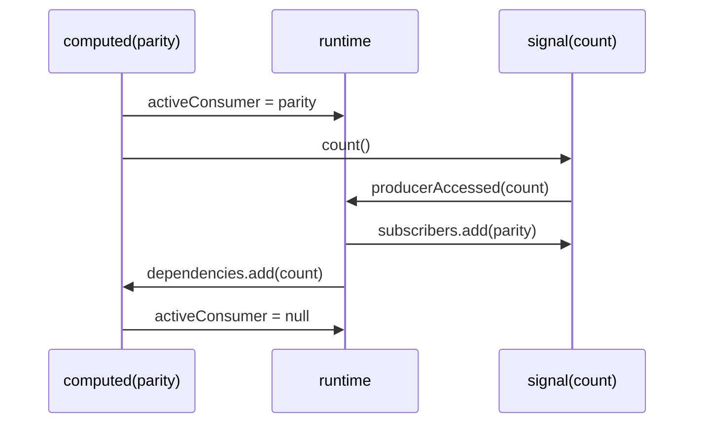
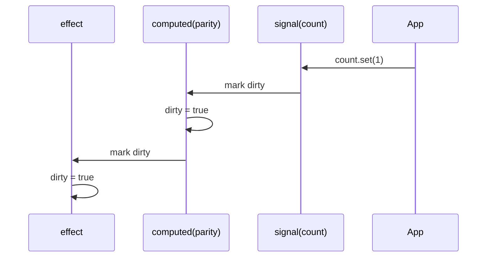
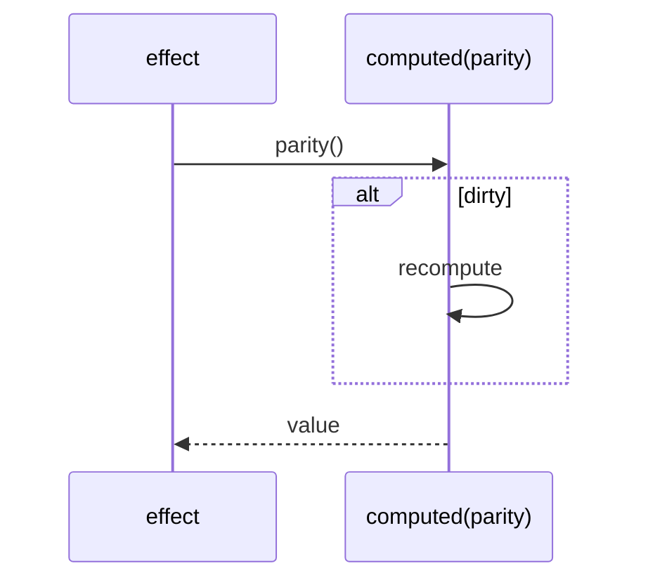

```mermaid
sequenceDiagram
    participant C as computed(parity)
    participant R as runtime
    participant S as signal(count)

    C->>R: activeConsumer = parity

    C->>S: count()

    S->>R: producerAccessed(count)

    R->>S: subscribers.add(parity)
    R->>C: dependencies.add(count)

    C->>R: activeConsumer = null
```

```mermaid
sequenceDiagram
    participant E as effect
    participant C as computed(parity)
    participant S as signal(count)
    participant App

    App->>S: count.set(1)

    S->>C: mark dirty
    C->>C: dirty = true

    C->>E: mark dirty
    E->>E: dirty = true
```

```mermaid
sequenceDiagram
    participant E as effect
    participant C as computed(parity)

    E->>C: parity()

    alt dirty
        C->>C: recompute
    end

    C-->>E: value
```